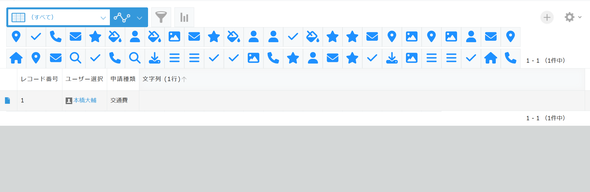
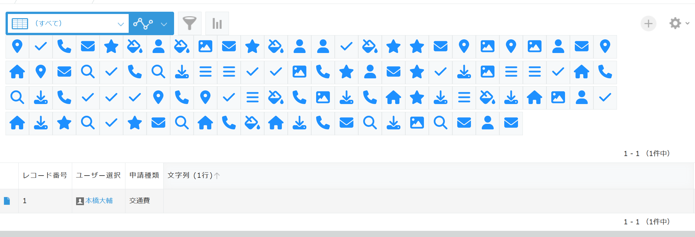
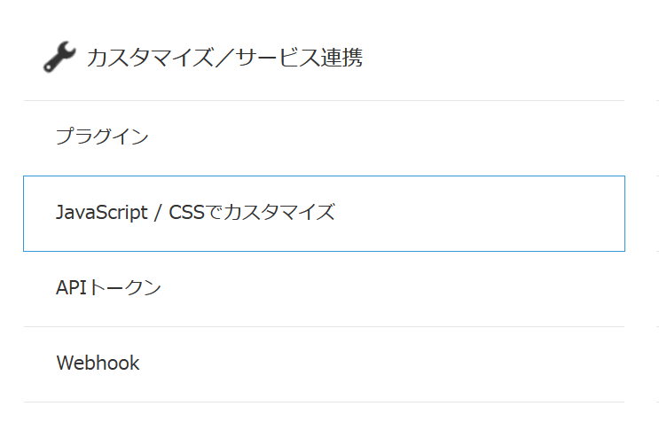
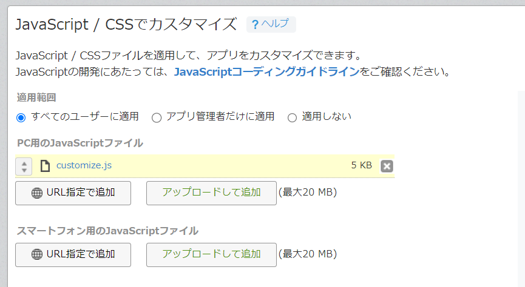

MenuItem100
========


## 機能

kintone用のJSカスタマイズとして適用すると、HeaderMenuSpaceにランダムで100個のアイコンを配置します。プラグイン開発のデバッグ用に必要となって作りました。



いずれかのアイコンをクリックするとHaderMenuSpaceを広げます。



もう一度アイコンをクリックするともとに戻ります。アイコン画像はみんな大好き[fontawesome](https://fontawesome.com/)です。

クリックイベントでは getHeaderMenuSpaceElement() の結果に'auto'のスタイルをあてたりもとに戻したりしています。

```javascript
    const hms = kintone.app.getHeaderMenuSpaceElement()
    hms.style.height = 'auto'
```

## インストール手順

1. <a href="https://raw.githubusercontent.com/motohasystem/headermenu100/main/dist/js/customize.js">costomize.js</a>をダウンロード
2. お使いのkintoneアプリの設定画面からJavaScriptカスタマイズの項目を開く



3. ダウンロードしたcustomize.jsを『PC用のJavaScriptファイル』としてアップロード



1. **『アプリを更新』** ボタンを押して更新

インストールは以上です。


## License

MenuItem100はMITライセンスの元で公開しています。
This plugin is licensed under MIT license.

Copyright (c) 2022 Daisuke Motohashi
https://opensource.org/licenses/MIT

